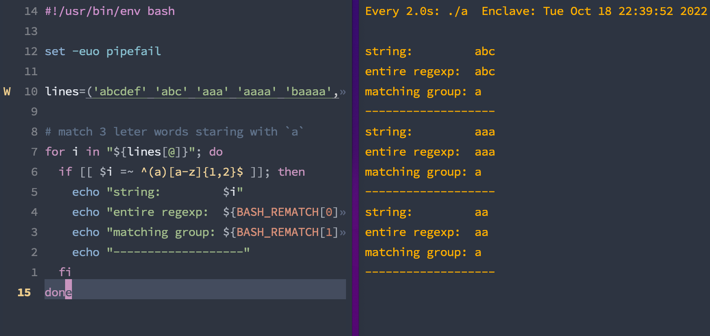

# Regexp comparison and matches

`BASH_REMATCH` holds on to the matches made with `=~`.

## impl

When matching against a REGEXP, you can reach into the matches for what it actually matched!

## Example

```bash
#!/usr/bin/env bash

set -euo pipefail

lines=('abcdef' 'abc' 'aaa' 'aaaa' 'baaaa', 'aa')

# match 3 leter words staring with `a`
for i in "${lines[@]}"; do
  if [[ $i =~ ^(a)[a-z]{1,2}$ ]]; then
    echo "string:         $i"
    echo "entire regexp:  ${BASH_REMATCH[0]}"
    echo "matching group: ${BASH_REMATCH[1]}"
    echo "-------------------"
  fi
done
```


