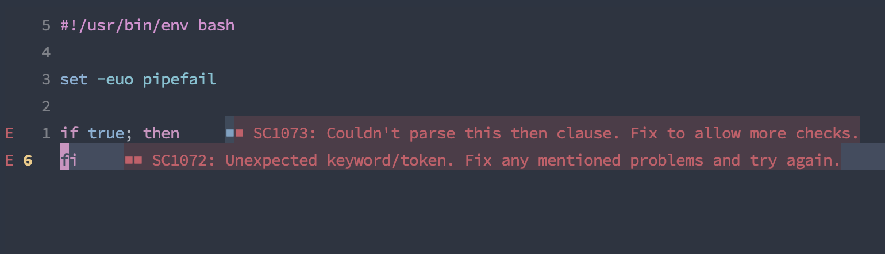
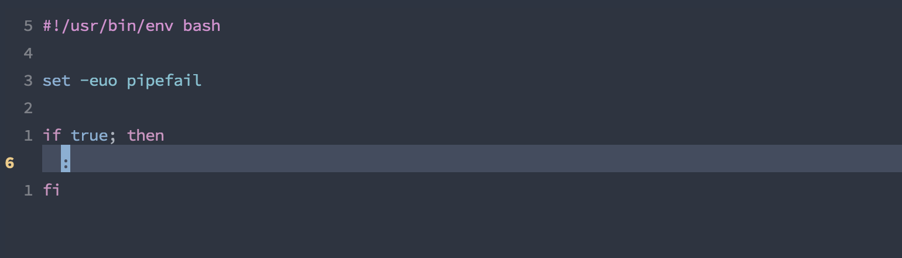

# Noop/pass in bash

it's the colon! `:`

## impl

An `if` statement must have a body in bash.

But if you are just playing around, or writing boilerplate, you want to 
hack it in and return later. Use the `:`

## Example

```sh
#!/usr/bin/env bash

if true; then
  :
fi
```

**before**



**after**

